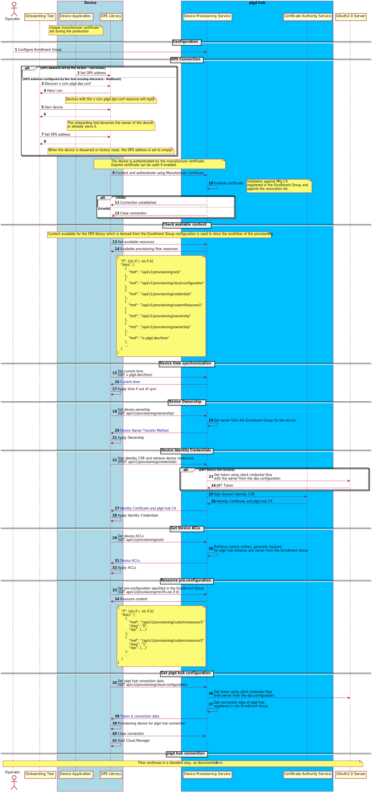

# Device Provisioning Service

The Device Provisioning Service provides an API to provision a device to the [plgd/hub](https://github.com/plgd-dev/hub).

## Workflow

<!--
Generate svg from .puml by running:
```sh
plantuml -tsvg workflow.puml
```
-->

.

## Docker Image

Before you use the image, you need to set up [K8s access to private registry](https://kubernetes.io/docs/tasks/configure-pod-container/pull-image-private-registry).

```bash
docker pull ghcr.io/plgd-dev/hub/device-provisioning-service:latest
```

## YAML Configuration

A configuration template is available on [config.yaml](https://github.com/plgd-dev/hub/device-provisioning-service/blob/main/config.yaml).

### Logging

| Property | Type | Description | Default |
| ---------- | -------- | -------------- | ------- |
| `log.dumpBody` | bool | `Set to true if you would like to dump raw messages.` | `false` |
| `log.level` | string |  `Minimum log level for logging. Logs with lower severity than this level will not be output. Supported levels: "debug", "info", "warn", "error".` | `"info"` |
| `log.encoding` | string | `Logging format. The supported values are: "json", "console"` | `"json"` |
| `log.stacktrace.enabled` | bool | `Log stacktrace.` | `false` |
| `log.stacktrace.level` | string | `Stacktrace from level.` | `"warn"` |
| `log.encoderConfig.timeEncoder` | string | `Time format for logs. The supported values are: "rfc3339nano", "rfc3339".` | `"rfc3339nano"` |

### CoAP API

CoAP API as specified in the [workflow](./workflow.puml).

| Property | Type | Description | Default |
| ---------- | -------- | -------------- | ------- |
| `apis.coap.address` | string | `Listening specification <host>:<port> for coap client connection.` | `"0.0.0.0:5688"` |
| `apis.coap.protocols` | []string | `Protocol for coap connection. The supported values are: "tcp", "udp" .` | `["tcp"]` |
| `apis.coap.maxMessageSize` | int | `Max message size which can be sent/received via coap. i.e. 256*1024 = 262144 bytes.` | `262144` |
| `apis.coap.messagePoolSize` | int | `Defines the maximum preallocated messages in the pool for parse/create coap messages.` | `1000` |
| `apis.coap.inactivityMonitor.timeout` | string | `Time limit to close inactive connection.` | `20s` |
| `apis.coap.blockwiseTransfer.enabled` | bool | `If true, enable blockwise transfer of coap messages.` | `true` |
| `apis.coap.blockwiseTransfer.blockSize` | int | `Size of blockwise transfer block.` | `1024` |
| `apis.coap.tls.keyFile` | string | `File path to private key in PEM format.` | `""` |
| `apis.coap.tls.certFile` | string | `File path to certificate in PEM format.` | `""` |

### HTTP API

The plgd device provisioning service REST API is defined by [swagger](https://raw.githubusercontent.com/plgd-dev/device-provisioning-service/main/pb/service.swagger.json).

| Property | Type | Description | Default |
| ---------- | -------- | -------------- | ------- |
| `apis.http.enabled` | bool | `Enable HTTP API.` | `false` |
| `apis.http.address` | string | `Listening specification <host>:<port> for http client connection.` | `"0.0.0.0:9100"` |
| `apis.http.tls.caPool` | string | `File path to the root certificate in PEM format which might contain multiple certificates in a single file.` |  `""` |
| `apis.http.tls.keyFile` | string | `File path to private key in PEM format.` | `""` |
| `apis.http.tls.certFile` | string | `File path to certificate in PEM format.` | `""` |
| `apis.http.tls.clientCertificateRequired` | bool | `If true, require client certificate.` | `true` |
| `apis.http.authorization.authority` | string | `Authority is the address of the token-issuing authentication server. Services will use this URI to find and retrieve the public key that can be used to validate the token’s signature.` | `""` |
| `apis.http.authorization.audience` | string | `Identifier of the API configured in your OAuth provider.` | `""` |
| `apis.http.authorization.http.maxIdleConns` | int | `It controls the maximum number of idle (keep-alive) connections across all hosts. Zero means no limit.` | `16` |
| `apis.http.authorization.http.maxConnsPerHost` | int | `It optionally limits the total number of connections per host, including connections in the dialing, active, and idle states. On limit violation, dials will block. Zero means no limit.` | `32` |
| `apis.http.authorization.http.maxIdleConnsPerHost` | int | `If non-zero, controls the maximum idle (keep-alive) connections to keep per-host. If zero, DefaultMaxIdleConnsPerHost is used.` | `16` |
| `apis.http.authorization.http.idleConnTimeout` | string | `The maximum amount of time an idle (keep-alive) connection will remain idle before closing itself. Zero means no limit.` | `30s` |
| `apis.http.authorization.http.timeout` | string | `A time limit for requests made by this Client. A Timeout of zero means no timeout.` | `10s` |
| `apis.http.authorization.http.tls.caPool` | string | `File path to the root certificate in PEM format which might contain multiple certificates in a single file.` |  `""` |
| `apis.http.authorization.http.tls.keyFile` | string | `File path to private key in PEM format.` | `""` |
| `apis.http.authorization.http.tls.certFile` | string | `File path to certificate in PEM format.` | `""` |
| `apis.http.authorization.http.tls.useSystemCAPool` | bool | `If true, use system certification pool.` | `false` |
| `apis.http.readTimeout` | string | `Maximum duration allowed for reading the entire request body, including the body by the server. A zero or negative value means there will be no timeout. Example: "8s" (8 seconds).` | `8s` |
| `apis.http.readHeaderTimeout` | string | `The amount of time allowed to read request headers by the server. If readHeaderTimeout is zero, the value of readTimeout is used. If both are zero, there is no timeout.` | `4s` |
| `apis.http.writeTimeout` | string | `The maximum duration before the server times out writing of the response. A zero or negative value means there will be no timeout.` | `16s` |
| `apis.http.idleTimeout` | string | `The maximum amount of time the server waits for the next request when keep-alives are enabled. If idleTimeout is zero, the value of readTimeout is used. If both are zero, there is no timeout.` | `30s` |

### Open telemetry exporter

The plgd open telemetry exporter configuration.

| Property | Type | Description | Default |
| ---------- | -------- | -------------- | ------- |
| `clients.openTelemetryCollector.grpc.enabled` | bool | `Enable OTLP gRPC exporter` | `false` |
| `clients.openTelemetryCollector.grpc.address` | string | `The gRPC collector to which the exporter is going to send data` | `""` |
| `clients.openTelemetryCollector.grpc.keepAlive.time` | string | `After a duration of this time if the client doesn't see any activity it pings the server to see if the transport is still alive.` | `10s` |
| `clients.openTelemetryCollector.grpc.keepAlive.timeout` | string | `After having pinged for keepalive check, the client waits for a duration of Timeout and if no activity is seen even after that the connection is closed.` | `20s` |
| `clients.openTelemetryCollector.grpc.keepAlive.permitWithoutStream` | bool | `If true, client sends keepalive pings even with no active RPCs. If false, when there are no active RPCs, Time and Timeout will be ignored and no keepalive pings will be sent.` | `true` |
| `clients.openTelemetryCollector.grpc.tls.caPool` | string | `File path to the root certificate in PEM format which might contain multiple certificates in a single file.` |  `""` |
| `clients.openTelemetryCollector.grpc.tls.keyFile` | string | `File path to private key in PEM format.` | `""` |
| `clients.openTelemetryCollector.grpc.tls.certFile` | string | `File path to certificate in PEM format.` | `""` |
| `clients.openTelemetryCollector.grpc.tls.useSystemCAPool` | bool | `If true, use system certification pool.` | `false` |

### Storage

The plgd device provisioning service uses MongoDB database.

| Property | Type | Description | Default |
| ---------- | -------- | -------------- | ------- |
| `clients.storage.cacheExpiration` | string | `Expiration time of cached records from database.` | `"10m"` |
| `clients.storage.mongoDB.uri` | string | `URI to mongo database.` | `"mongodb://localhost:27017"` |
| `clients.storage.mongoDB.database` | string | `Name of database` | `"deviceProvisioning"` |
| `clients.storage.mongoDB.maxPoolSize` | int | `Limits number of connections.` | `16` |
| `clients.storage.mongoDB.maxConnIdleTime` | string | `Close connection when idle time reach the value.` | `4m0s` |
| `clients.storage.mongoDB.tls.caPool` | string | `File path to the root certificate in PEM format which might contain multiple certificates in a single file.` |  `""` |
| `clients.storage.mongoDB.tls.keyFile` | string | `File path to private key in PEM format.` | `""` |
| `clients.storage.mongoDB.tls.certFile` | string | `File path to certificate in PEM format.` | `""` |
| `clients.storage.mongoDB.tls.useSystemCAPool` | bool | `If true, use system certification pool.` | `false` |
| `clients.storage.mongoDB.bulkWrite.timeout` | string | `A time limit for write bulk to mongodb. A Timeout of zero means no timeout.` | `1m0s` |
| `clients.storage.mongoDB.bulkWrite.throttleTime` | string | `The amount of time to wait until a record is written to mongodb. Any records collected during the throttle time will also be written. A throttle time of zero writes immediately. If recordLimit is reached, all records are written immediately.` | `500ms` |
| `clients.storage.mongoDB.bulkWrite.documentLimit` | uint16 | `The maximum number of documents to cache before an immediate write.` | `1000` |

### Enrollment groups

Enrollment group entry configuration.

| Property | Type | Description | Default |
| ---------- | -------- | -------------- | ------- |
| `enrollmentGroups.[].id` | string | `Unique enrollment group id in GUID format` | `""` |
| `enrollmentGroups.[].owner` | string | `Owner of a newly provisioned device` | `""` |
| `enrollmentGroups.[].preSharedKeyFile` | string | `Path to the pre-shared key that will be stored on the device. It must either be empty or contain exactly 16 characters. If the key does not meet this requirement, the provisioning will fail.` | `""` |
| `enrollmentGroups.[].attestationMechanism.x509.certificateChain` | string | `File path to certificate chain in PEM format.` | `""` |
| `enrollmentGroups.[].attestationMechanism.x509.expiredCertificateEnabled` | bool | `Accept device connections with an expired certificate.` | `false` |

#### Hub

Defines configuration of the plgd hub where the device connects after it's successfully provisioned.

| Property | Type | Description | Default |
| ---------- | -------- | -------------- | ------- |
| `enrollmentGroups.[].hub.caPool` | string | `File path to the root certificate in PEM format. Multiple certificates in a single file are supported.` |  `""` |
| `enrollmentGroups.[].hub.hubID` | string | `Uniqhe id of the plgd hub instance.` |  `""` |
| `enrollmentGroups.[].hub.coapGateway` | string | `plgd hub CoAP gateway endpoint where the devices should connect to after successful provisioning.Format <IP:PORT>.` |  `""` |
| `enrollmentGroups.[].hub.certificateAuthority.grpc.address` | string | `plgd hub Certificate Authority endpoint used to sign device identity CSRs. Format <IP:PORT>.` |  `""` |
| `enrollmentGroups.[].hub.certificateAuthority.grpc.keepAlive.time` | string | `After a duration of this time if the client doesn't see any activity it pings the server to see if the transport is still alive.` | `10s` |
| `enrollmentGroups.[].hub.certificateAuthority.grpc.keepAlive.timeout` | string | `After having pinged for keepalive check, the client waits for a duration of Timeout and if no activity is seen even after that the connection is closed.` | `20s` |
| `enrollmentGroups.[].hub.certificateAuthority.grpc.keepAlive.permitWithoutStream` | bool | `If true, client sends keepalive pings even with no active RPCs. If false, when there are no active RPCs, Time and Timeout will be ignored and no keepalive pings will be sent.` | `true` |
| `enrollmentGroups.[].hub.certificateAuthority.grpc.tls.caPool` | string | `File path to the root certificate in PEM format which might contain multiple certificates in a single file.` |  `""` |
| `enrollmentGroups.[].hub.certificateAuthority.grpc.tls.keyFile` | string | `File path to private key in PEM format.` | `""` |
| `enrollmentGroups.[].hub.certificateAuthority.grpc.tls.certFile` | string | `File path to certificate in PEM format.` | `""` |
| `enrollmentGroups.[].hub.certificateAuthority.grpc.tls.useSystemCAPool` | bool | `If true, use system certification pool.` | `false` |

#### OAuth2.0 Client

OAuth2.0 Client is used to obtain JWT with ownerClaim and deviceIDClaim via the client credentials flow. The JWT will be is used directly during the [SignUp operation](https://plgd.dev/architecture/component-overview/#hub-registration).

| Property | Type | Description | Default |
| ---------- | -------- | -------------- | ------- |
| `enrollmentGroups.[].hub.authorization.ownerClaim` | string | `Claim used to identify the owner of the device. If configured, your OAuth2.0 server has to set the owner id to the token as configured. OwnerClaim with sub is not supported. Custom owner claim needs to be configured also on the plgd hub instance. If used with the plgd mock OAuth Server, value https://plgd.dev/owner has to be set. **Required.**` | `""` |
| `enrollmentGroups.[].hub.authorization.deviceIDClaim` | string | `Claim used to make JWT tokens device specific. If configured, your OAuth2.0 server has to set the device id to the token as configured. If used with the plgd mock OAuth Server, value https://plgd.dev/deviceId has to be set.` | `""` |
| `enrollmentGroups.[].hub.authorization.provider.name` | string | `Provider name which is registered also on the instance of the plgd hub where the device connects after it's successfully provisioned. The grant type for this provider must be set to ClientCredentials.` | `""` |
| `enrollmentGroups.[].hub.authorization.provider.authority` | string | `Authority is the address of the token-issuing authentication server. Services will use this URI to find token endpoint.` | `""` |
| `enrollmentGroups.[].hub.authorization.provider.clientID` | string | `OAuth Client ID.` | `""` |
| `enrollmentGroups.[].hub.authorization.provider.clientSecretFile` | string | `File path to client secret required to request an access token.` |  `""` |
| `enrollmentGroups.[].hub.authorization.provider.audience` | string | `Audience of OAuth provider.` | `""` |
| `enrollmentGroups.[].hub.authorization.provider.http.maxIdleConns` | int | `Maximum number of idle (keep-alive) connections across all hosts. Zero means no limit.` | `16` |
| `enrollmentGroups.[].hub.authorization.provider.http.maxConnsPerHost` | int | `Limit the total number of connections per host, including connections in the dialing, active, and idle states. On limit violation, dials will be blocked. Zero means no limit.` | `32` |
| `enrollmentGroups.[].hub.authorization.provider.http.maxIdleConnsPerHost` | int | `If non-zero, controls the maximum idle (keep-alive) connections to keep per-host. If zero, DefaultMaxIdleConnsPerHost is used.` | `16` |
| `enrollmentGroups.[].hub.authorization.provider.http.idleConnTimeout` | string | `The maximum time an idle (keep-alive) connection will remain idle before closing itself. Zero means no limit.` | `30s` |
| `enrollmentGroups.[].hub.authorization.provider.http.timeout` | string | `A time limit for requests made by this Client. A Timeout of zero means no timeout.` | `10s` |
| `enrollmentGroups.[].hub.authorization.provider.http.tls.caPool` | string | `File path to the root certificate in PEM format which might contain multiple certificates in a single file.` |  `""` |
| `enrollmentGroups.[].hub.authorization.provider.http.tls.keyFile` | string | `File path to private key in PEM format.` | `""` |
| `enrollmentGroups.[].hub.authorization.provider.http.tls.certFile` | string | `File path to certificate in PEM format.` | `""` |
| `enrollmentGroups.[].hub.authorization.provider.http.tls.useSystemCAPool` | bool | `If true, use system certification pool.` | `false` |

::: tip Audience
You might have one client, but multiple APIs registered in the OAuth2.0 Server. What you might want to prevent is to be able to contact all the APIs of your system with one token. This audience allows you to request the token for a specific API. If you configure it to myplgdc2c.api in the Auth0, you have to set it here if you want to also validate it.
:::

### Task Queue

| Property | Type | Description | Default |
| ---------- | -------- | -------------- | ------- |
| `taskQueue.goPoolSize` | int | `Maximum number of running goroutine instances.` | `1600` |
| `taskQueue.size` | int | `Size of queue. If it exhausted, submit returns error.` | `2097152` |
| `taskQueue.maxIdleTime` | string | `Sets up the interval time of cleaning up goroutines. Zero means never cleanup.` | `10m` |

> Note that the string type related to time (i.e. timeout, idleConnTimeout, expirationTime) is decimal numbers, each with optional fraction and a unit suffix, such as "300ms", "1.5h" or "2h45m". Valid time units are "ns", "us", "ms", "s", "m", "h".
